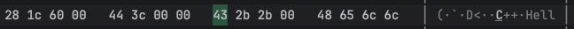

# Phase 1: メモリとは何か

## Phase1のゴール

次の2つを理解することがゴールとなる。

① 変数はメモリに保存される  
② 数値はバイト列として保存される

つまり：

```
int x = 100;
```

は

```
64 00 00 00
```

として保存される（環境依存だが概念として）。

※以下は別の変数のメモリビューの例。バイト列として保存されている。



---

## Step 1: メモリは「ただの箱」

C++では：

```cpp
int x = 100;
```

これは実際には：

- メモリ4バイト確保
- そこに100を書き込む

という操作になる。

---

## Step 2: int は何バイト？

Mac環境では通常：

```
sizeof(int) = 4
```

確認コード：

```cpp
#include <iostream>

int main()
{
    std::cout << sizeof(int) << std::endl;
}
```

---

## Step 3: メモリの中身を見る

次のコードでメモリの中身を1バイトずつ表示できる。

```cpp
#include <iostream>
#include <cstdint>

// メモリの中身を1バイトずつ表示する関数
void printBytes(void* ptr, size_t size)
{
    // void* は型情報がないので uint8_t* に変換
    uint8_t* p = static_cast<uint8_t*>(ptr);

    for(size_t i = 0; i < size; i++)
    {
        std::cout << (int)p[i] << " ";
    }

    std::cout << std::endl;
}

int main()
{
    int x = 100;

    std::cout << "sizeof(x): "
              << sizeof(x)
              << std::endl;

    printBytes(&x, sizeof(x));
}
```

### 処理の解説

`&x` は x のメモリアドレスを表す。`void* ptr` は型なしアドレスのため、1バイト単位で読むために `uint8_t*` に変換している。

実行結果：

```
100 0 0 0
```

または：

```
0 0 0 100
```

どちらになるかは**エンディアン**の違いによる（後述）。

---

## Step 4: 別の数値で試す

```cpp
int x = 1;
```

予想結果：

```
1 0 0 0
```

```cpp
int x = 256;
```

予想結果：

```
0 1 0 0
```

256 は `00000001 00000000` という2バイトの表現になるため、このようになる。

---

## Step 5: 配列のメモリを見る

```cpp
#include <iostream>
#include <cstdint>

void printBytes(void* ptr, size_t size)
{
    uint8_t* p = static_cast<uint8_t*>(ptr);

    for(size_t i = 0; i < size; i++)
    {
        std::cout << (int)p[i] << " ";
    }

    std::cout << std::endl;
}

int main()
{
    uint8_t buffer[8] = {10,20,30,40,50,60,70,80};

    printBytes(buffer, sizeof(buffer));
}
```

結果：

```
10 20 30 40 50 60 70 80
```

配列はメモリ上に連続して配置される。

---

## Step 6: メモリは隙間なく並ぶ

```cpp
int main()
{
    uint8_t buffer[3] = {10,20,30};

    std::cout << (int)&buffer[0] << std::endl;
    std::cout << (int)&buffer[1] << std::endl;
    std::cout << (int)&buffer[2] << std::endl;
}
```

結果（例）：

```
1000
1001
1002
```

アドレスが +1 ずつ増える。これが **offset** の正体となる。

---

## まとめ

この章で理解すべき概念：

① `int` は4バイト  
② 数値はバイト列として保存される  
③ 配列は連続メモリ  
④ `&x` はアドレス  
⑤ `uint8_t*` は1バイト単位アクセス  

これらを理解すると `buffer + offset` の意味が完全に把握できる。

---

# 補足：1バイトとは何か

1バイトは8ビットである。ビットとは `0` か `1` のどちらかだけを持つ最小単位。

```
1ビット = 2通り
```

---

## 8ビットなら何通り？

8ビットなので：

```
2 × 2 × 2 × 2 × 2 × 2 × 2 × 2
= 2^8
= 256通り
```

表現できる。

---

## 256通りあるなら最大値はいくつ？

256通りということは `0〜255` まで表現できる。

0 を含むため全部で 256 個となり、最大値は 255 になる。

---

## 具体的に書くとこうなる

8ビット：

```
00000000 = 0
00000001 = 1
00000010 = 2
...
11111111 = 255
```

最大値は255。

---

## では256はどう表現される？

256は：

```
00000001 00000000
```

になる。1バイトでは `11111111` までしか入らないため、2バイト必要になる。

---

## 実際のメモリでの並び方

```cpp
uint8_t x = 255;
```

なら：

```
11111111
```

```cpp
uint16_t x = 256;
```

なら：

```
00000001 00000000
```

になる。

---

## 1バイト単位の重要性

バイナリ操作で扱う次の概念はすべて「1バイト単位で世界が動いている」という前提の上に成り立っている。

```
uint8_t*
buffer
binary layout
offset
```

つまり：

```
buffer + 1
```

は「1バイト進む」という意味になる。
